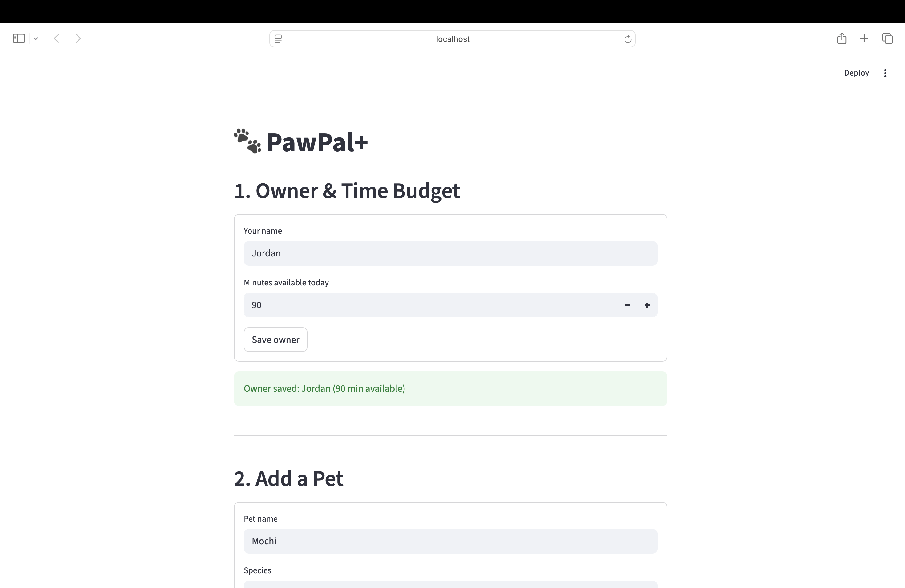

# PawPal+ (Module 2 Project)

**PawPal+** is a Streamlit app that helps a busy pet owner plan daily care tasks across multiple pets — considering time budgets, task priority, recurring schedules, and time conflicts.

## 📸 Demo

<a href="/course_images/ai110/pawpal_screenshot.png" target="_blank"></a>

<a href="pawpal_screenshot.png" target="_blank"></a>

## Features

- **Multi-pet support** — Add as many pets as you like; tasks are tracked per pet and aggregated across all of them for scheduling.

- **Priority-based scheduling** — The scheduler greedily fills your daily time budget starting from the highest-priority tasks (high → medium → low). Within the same priority tier, shorter tasks are preferred to maximise the number of tasks completed.

- **Chronological sorting** — `Scheduler.sort_by_time()` orders tasks by their `start_time` (HH:MM, 24-hour). Tasks without an explicit time fall back to slot defaults: morning → 08:00, afternoon → 13:00, evening → 18:00.

- **Task filtering** — `Scheduler.filter_tasks()` lets you view tasks by pet name, completion status, or both — useful for seeing only what still needs doing.

- **Recurring task recurrence** — `Task.mark_complete()` auto-advances `due_date` using Python's `timedelta`: daily tasks recur the next day, weekly tasks recur in 7 days. One-off (`as-needed`) tasks stay completed.

- **Conflict detection** — `Scheduler.detect_conflicts()` checks whether any two tasks for the same pet have overlapping `[start, start+duration)` windows. Conflicts are shown as yellow warnings in the UI — the plan is still generated so the owner can decide how to resolve them.

- **Plan explanation** — `DailyPlan.explain()` narrates why each task was included or skipped, giving the owner transparency into the scheduling decisions.

- **Input validation** — `Task.__post_init__` rejects invalid data (zero/negative duration, malformed times) at construction time, so bad tasks can never enter the scheduler.

## Scenario

A busy pet owner needs help staying consistent with pet care. They want an assistant that can:

- Track pet care tasks (walks, feeding, meds, enrichment, grooming, etc.)
- Consider constraints (time available, priority, owner preferences)
- Produce a daily plan and explain why it chose that plan

## Getting started

### Setup

```bash
python -m venv .venv
source .venv/bin/activate  # Windows: .venv\Scripts\activate
pip install -r requirements.txt
```

### Suggested workflow

1. Read the scenario carefully and identify requirements and edge cases.
2. Draft a UML diagram (classes, attributes, methods, relationships).
3. Convert UML into Python class stubs (no logic yet).
4. Implement scheduling logic in small increments.
5. Add tests to verify key behaviors.
6. Connect your logic to the Streamlit UI in `app.py`.
7. Refine UML so it matches what you actually built.

## Smarter Scheduling

Beyond the basic greedy planner, `pawpal_system.py` includes four algorithmic enhancements:

- **Sort by time** — `Scheduler.sort_by_time()` orders any task list chronologically using each task's `start_time` (HH:MM) or a slot default (`morning → 08:00`, `afternoon → 13:00`, `evening → 18:00`). Uses a `lambda` key with Python's built-in `sorted()`.

- **Filter tasks** — `Scheduler.filter_tasks(pet_name, completed)` lets you slice the full task list by pet name, completion status, or both. Useful for showing only pending tasks or a single pet's workload.

- **Recurring tasks** — `Task.mark_complete()` auto-advances `due_date` using `timedelta`: daily tasks move +1 day, weekly tasks move +7 days, and `as-needed` tasks stay completed. No manual reset required.

- **Conflict detection** — `Scheduler.detect_conflicts()` checks whether any two tasks for the same pet have overlapping `[start, start+duration)` windows and returns human-readable warning strings. Conflicts are surfaced in `DailyPlan.display()` rather than blocking the schedule, preserving owner flexibility.

## Testing PawPal+

### Run the tests

```bash
python3 -m pytest tests/ -v
```

### What the tests cover

19 tests across 6 categories in `tests/test_pawpal.py`:

| Category | What is verified |
|---|---|
| **Task validation** | `Task` rejects zero or negative duration at construction time |
| **Recurrence logic** | Daily tasks auto-advance `due_date` by +1 day and reset `completed`; weekly by +7 days; `as-needed` stays completed permanently |
| **Pet task management** | `add_task()` grows the task list; `get_pending_tasks()` excludes completed tasks |
| **Sorting correctness** | `sort_by_time()` returns tasks in chronological order whether using an explicit `start_time` or a slot default (morning/afternoon/evening) |
| **Conflict detection** | Overlapping windows are flagged; back-to-back tasks are not; tasks without a `start_time` are safely ignored |
| **Edge cases** | Owner with no pets, pet with no tasks, single task exceeding the full time budget, filtering by pet name |

### Confidence level

★★★★☆ (4 / 5)

The core scheduling, recurrence, sorting, and conflict detection are well covered. The one-star gap reflects untested areas: the Streamlit UI layer has no automated tests, and the greedy scheduling algorithm is not tested against all possible priority + duration combinations (e.g. a mix where a lower-priority short task fits but a high-priority long one does not).
